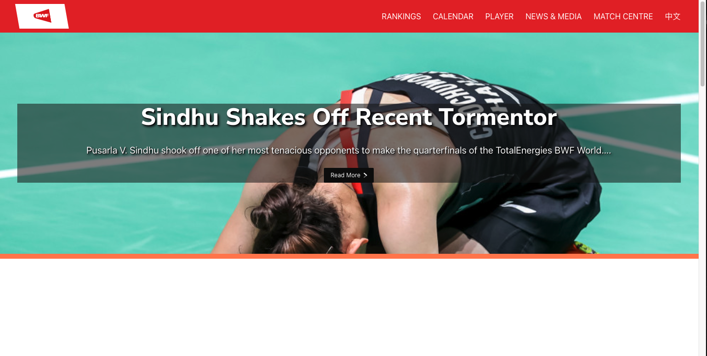

# Badminton React


## Key Features

- Latest top badminton news
  - 

- Additional latest badminton news 
  - 

- Schedule of upcoming competitions
  - 

- Page to display current top ranked players
  - 

- Page to display current rankings
  - 


### Component for a Single Player on the player display page:


```js
class SinglePlayer extends Component {

    constructor(props){
        super(props);
    }
    render() {
        return (
            <div className="individualPlayer">
                <div className="playerImage">
                    <div className="playerPhoto">
                        
                    </div>
                    <div className="playerFlag">
                        
                    </div>
                </div>

                <div className="playerName">
                    <div><span class="name-first" title="player-first-name">{this.props.firstName}</span><span class="name-last">{this.props.lastName}</span></div>
                </div>
            </div>
        )
    }
}
```

### Data of the players on the player display page


```js
let playerInfoArr2 = [
    {
      firstName: 'Chris',
      lastName: 'Adcock',
      photoURL: 'https://res.cloudinary.com/bwf/t_96_player_profile/v1604895468/assets/players/thumbnail/70333',
      flagURL: 'https://extranet.bwfbadminton.com/docs/flags-svg/england.svg'

    },
    {
        firstName: 'Pusarla',
        lastName: 'V. Sindhu',
        photoURL: 'https://res.cloudinary.com/bwf/t_96_player_profile/v1627948657/assets/players/thumbnail/73173',
        flagURL: 'https://extranet.bwfbadminton.com/docs/flags-svg/india_1.svg'
  
      },
```

### Example of a test

```js
test('renders the copyright', () => {
  render(<Parallax />);
  const element = screen.getByTitle(/copyright/i);
  expect(element).toBeInTheDocument();
});
```
Tests passing
  - 
